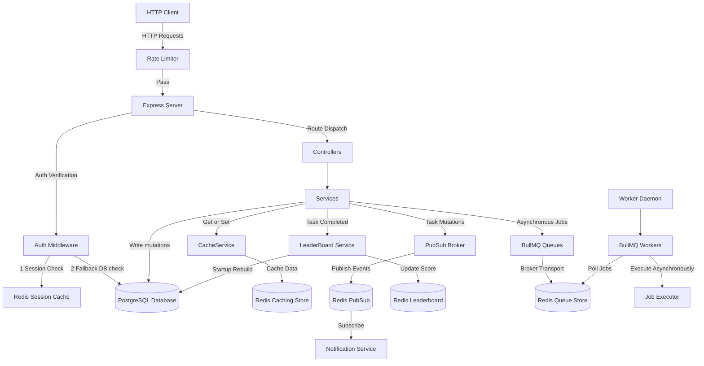
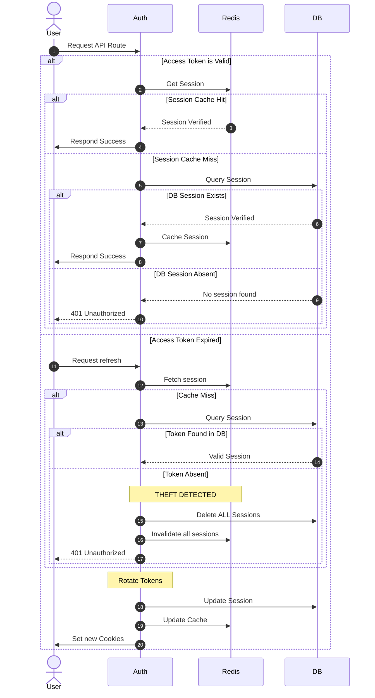

# 🚀 Redis Masterclass - Advanced Backend Architecture

Welcome to the **Redis Masterclass** project! This repository represents a state-of-the-art, high-performance Node.js backend built with **TypeScript**, **Express**, **Prisma (PostgreSQL)**, and **Redis**. 

The system serves as a showcase of advanced backend patterns, utilizing Redis not just as a simple key-value cache, but also as a multi-device session store, a sliding-window rate limiter driven by custom atomic Lua scripts, a real-time Pub/Sub broker, a global real-time Leaderboard tracker via Sorted Sets (ZSET), and a distributed queue coordinator (BullMQ) for asynchronous task execution.

---

## 🗺️ System Architecture

The following diagram illustrates how all architectural layers—the HTTP Router, Prisma DB, Redis Cache, Pub/Sub channels, Sorted Sets, and BullMQ background workers—interact seamlessly:



---

## 🚀 Key Architectural Flows

### 1. Multi-Device Authentication & Theft Rotation Flow
The system supports concurrent login sessions from different devices (`deviceId`), securing them with rotated Access & Refresh JWTs:



---

## 🛠️ Technology Stack & Core Dependencies

This project relies on a highly curated stack of modern, premium development tools:

- **Core Runtime**: [Node.js](https://nodejs.org/) with [TypeScript](https://www.typescriptlang.org/) for solid type safety.
- **Web Framework**: [Express 5](https://expressjs.com/) (`express@5.2.1`) for high-performance HTTP routing.
- **Database ORM**: [Prisma](https://www.prisma.io/) (`@prisma/client@7.8.0`) paired with the high-performance PostgreSQL driver [pg](https://node-postgres.com/).
- **In-Memory Store**: [ioredis](https://github.com/redis/ioredis) (`ioredis@5.10.1`) for connecting to and executing complex commands on Redis.
- **Background Jobs**: [BullMQ](https://bullmq.io/) (`bullmq@5.76.8`) for managing distributed, resilient background job queues.
- **Validation**: [Zod](https://zod.dev/) for type-safe environment variable parses at runtime.
- **Linter & Formatter**: [Biome](https://biomejs.dev/) (`@biomejs/biome`) providing lightning-fast styling checks and formatting.
- **Execution Engine**: [tsx](https://github.com/privateatr/tsx) for hot-reloading development without a precompile build step.

---

## ⚙️ Environment Configuration

Environment configurations are parsed and strictly validated at process startup using a type-safe Zod schema inside [`src/config/env.ts`](file:///Users/notsherlok/WorkSpace/Practice/redis/redis-masterclass/src/config/env.ts). If any required environment variable is missing or malformed, the process immediately logs a formatted schema error and exits safely (`process.exit(1)`).

| Variable Name | Type | Allowed Values / Pattern | Default Value | Description |
| :--- | :--- | :--- | :--- | :--- |
| `PORT` | `number` | Positive integers (e.g., `3000`) | *Required* | The port the Express application server listens on. |
| `REDIS_HOST` | `string` | Valid hostnames/IPs | *Required* | The address of the Redis server. |
| `REDIS_PORT` | `number` | Valid port number | *Required* | The port of the Redis server. |
| `REDIS_PASSWORD`| `string` | Strong password strings | *Required* | Password for Redis authentication. |
| `POSTGRES_URL` | `string` | `postgresql://...` URI format | *Required* | Raw PostgreSQL connection string (utility connection). |
| `DATABASE_URL` | `string` | `postgresql://...` URI format | *Required* | Prisma-specific PostgreSQL connection string. |
| `NODE_ENV` | `string` | `development` \| `staging` \| `production` | `development` | The runtime environment flag. |
| `JWT_ACCESS_SECRET`| `string` | Strong string (min. 32 chars) | *Required* | Symmetric key used to sign Access JWT tokens. |
| `JWT_REFRESH_SECRET`| `string`| Strong string (min. 32 chars) | *Required* | Symmetric key used to sign Refresh JWT tokens. |
| `JWT_ACCESS_EXPIRES_IN` | `string` | Time strings (e.g., `"15m"`, `"1h"`) | `"15m"` | Token expiration configuration for Access JWTs. |
| `JWT_REFRESH_EXPIRES_IN`| `string`| Time strings (e.g., `"7d"`, `"30d"`) | `"7d"` | Token expiration configuration for Refresh JWTs. |
| `JWT_ACCESS_EXPIRES_MS` | `number`| Integer milliseconds | `900000` | Expiration offset in ms for Access Cookies (15 min). |
| `JWT_REFRESH_EXPIRES_MS`| `number`| Integer milliseconds | `604800000` | Expiration offset in ms for Refresh Cookies (7 days). |

---

## 🗄️ Database Schema & Models

Our database layer, powered by PostgreSQL and mapped via [`prisma/schema.prisma`](file:///Users/notsherlok/WorkSpace/Practice/redis/redis-masterclass/prisma/schema.prisma), consists of two core tables, a session tracker for multi-device logins, and an status Enum:

### `User` Model
Represents registered users in our system.
- `id` (String): Primary key, defaults to high-performance `nanoid()`.
- `email` (String): Unique email used for registration/login.
- `password` (String): Bcrypt-hashed password.
- `createdAt` (DateTime): Registration timestamp.

### `Session` Model
Stores active user sessions per device to enable token rotation security.
- `id` (String): Primary Key, defaults to `nanoid()`.
- `userId` (String): Foreign Key referencing `User.id` (Cascades on delete).
- `deviceId` (String): Unique identifier of the device.
- `deviceInfo` (String?): User-Agent information.
- `ipAddress` (String?): Client IP Address.
- `refreshToken` (String): Rotated refresh token (Unique key).
- `createdAt` (DateTime): Session creation timestamp.
- **Indexes**:
  - `@@index([userId])` (Faster query lookups by user).
  - `@@index([refreshToken])` (Faster query lookups during token rotation checks).
  - `@@unique([userId, deviceId])` (Enforces one unique active session per user-device pair).

### `Task` Model
Stores user tasks that drive leaderboard scores.
- `id` (String): Primary Key, defaults to `nanoid()`.
- `title` (String): Task title.
- `description` (String): Task details.
- `status` (TaskStatus): Enum value representing state: `pending`, `in_progress`, or `completed`.
- `userId` (String): Foreign Key referencing `User.id` (Cascades on delete).
- **Indexes**:
  - `@@index([userId])` (Speeds up listing tasks by user).

---

## 📦 Core Module Implementations

### 🔐 1. Authentication Module (`src/modules/auth`)
Coordinates the sign-up, sign-in, and sign-out pipelines, utilizing dual caching mechanisms to verify multi-device requests with zero latency.
- **Router**: [`auth.routes.ts`](file:///Users/notsherlok/WorkSpace/Practice/redis/redis-masterclass/src/modules/auth/auth.routes.ts) defines API routes and wires up controllers.
- **Controller**: [`auth.controller.ts`](file:///Users/notsherlok/WorkSpace/Practice/redis/redis-masterclass/src/modules/auth/auth.controller.ts) extracts client details (IP Address, User-Agent, cookie contexts) and binds them into a `DeviceContext`.
- **Service**: [`auth.service.ts`](file:///Users/notsherlok/WorkSpace/Practice/redis/redis-masterclass/src/modules/auth/auth.service.ts) coordinates business logic:
  - **Multi-Device Storage**: Each user can log in on multiple devices. Sessions are stored in PostgreSQL and cached in a Redis **Hash** via `HSET` at key `auth:sessions:userId` with the `deviceId` acting as the field.
  - **Theft Detection & Security Rotation**: When rotating refresh tokens, the service verifies the request token against active sessions. If a refresh token is reused (signifying that it has been intercepted by an attacker), a **Theft Detected** error is thrown. The system automatically executes a complete database purge of all sessions for that user (`deleteAllUserSessions`) and purges the Redis cache (`DEL`), instantly logging the user out of all devices and terminating access.
- **Repository**: [`auth.repository.ts`](file:///Users/notsherlok/WorkSpace/Practice/redis/redis-masterclass/src/modules/auth/auth.repository.ts) encapsulates raw Prisma queries.

### 📋 2. Task Module (`src/modules/tasks`)
Demonstrates robust write-through and read-through caching.
- **Router**: [`task.routes.ts`](file:///Users/notsherlok/WorkSpace/Practice/redis/redis-masterclass/src/modules/tasks/task.routes.ts) configures protected routes.
- **Controller**: [`task.controller.ts`](file:///Users/notsherlok/WorkSpace/Practice/redis/redis-masterclass/src/modules/tasks/task.controller.ts) acts as the HTTP entry point.
- **Service**: [`task.service.ts`](file:///Users/notsherlok/WorkSpace/Practice/redis/redis-masterclass/src/modules/tasks/task.service.ts) manages the task lifecycle and cache synchronization:
  - **Read-Through Caching**: Requests for user tasks are first routed to Redis. If cached (`tasks:user:userId` or `tasks:id:taskId` key hits), the payload is parsed and returned instantly. Otherwise, the database is queried, the response is stored in Redis (cached with a Default TTL), and sent back.
  - **Write-Through Invalidation**: Mutations (creates, updates, deletes) perform writes to Postgres and concurrently invalidate relevant cache keys (`CacheKeys.tasks.byId`, `CacheKeys.tasks.byUser`, `CacheKeys.tasks.all`) to prevent stale reads.
  - **Event Pub/Sub Broadcasts**: Mutations trigger real-time publish events via `notificationService.publishTaskEvent`.
  - **Asynchronous Queue Jobs**: Tasks create background jobs inside BullMQ (`emailQueue` & `notificationQueue`) to handle emails and notification logging concurrently.
  - **Leaderboard Integration**: Marking a task's status as `completed` automatically increments the user's score in the global leaderboard.

### 🏆 3. Leaderboard Module (`src/modules/leaderboard`)
Maintains a highly efficient real-time rank tracker that leverages a Redis **Sorted Set** (ZSET) to score users based on completed task counts.
- **Sorted Set Key**: `leaderboard:global`
- **Controller**: [`leaderboard.controller.ts`](file:///Users/notsherlok/WorkSpace/Practice/redis/redis-masterclass/src/modules/leaderboard/leaderboard.controller.ts) handles leaderboard GET requests.
- **Service**: [`leaderboard.service.ts`](file:///Users/notsherlok/WorkSpace/Practice/redis/redis-masterclass/src/modules/leaderboard/leaderboard.service.ts) encapsulates sorted set operations:
  - **Score Increment**: Completing a task triggers `zincrby(key, 1, userId)`, dynamically adjusting the user's score and recalculating ranks instantly.
  - **Top Rankings Query**: `zrevrange(key, 0, limit - 1, "WITHSCORES")` fetches the top users ordered by score with $O(\log(N) + M)$ complexity.
  - **User Specific Rank**: `zrevrank(key, userId)` gets a user's exact ranking (0-based, incremented by 1), and `zscore(key, userId)` fetches their score.
  - **Startup Rebuild Sync**: On application bootstrap, the service triggers `rebuildLeaderBoard()`, querying the database for all completed task counts grouped by user, deleting stale leaderboard keys (`DEL`), and rebuilding the sorted set with high-speed performance utilizing a Redis **Pipeline**.

### 📢 4. Notification & Pub/Sub Module (`src/modules/notifications`)
Implements real-time messaging using standard Redis Pub/Sub channels.
- **Pub/Sub Wrapper**: [`pubsub.ts`](file:///Users/notsherlok/WorkSpace/Practice/redis/redis-masterclass/src/lib/pubsub.ts) exports wrappers to register event listeners on dedicated sub channels.
- **Independent Connections**: Redis Pub/Sub requires exclusive subscriber connections. Therefore, [`redis.ts`](file:///Users/notsherlok/WorkSpace/Practice/redis/redis-masterclass/src/lib/redis.ts) instantiates three isolated Redis clients: `main` (for general queries/commands), `publisher` (only for publishing events), and `subscriber` (only for listening to events).
- **Service**: [`notification.service.ts`](file:///Users/notsherlok/WorkSpace/Practice/redis/redis-masterclass/src/modules/notifications/notification.service.ts) maps channels (`tasks:created`, `tasks:updated`, `tasks:deleted`) and registers handlers when the server starts up.

### 📨 5. BullMQ Background Workers (`src/jobs`)
Asynchronous job processing is crucial for high-throughput backends. BullMQ delegates intense operations (like sending emails or formatting notification feeds) into backend processes so standard HTTP responses return instantly.
- **Queue Definitions**: [`queue.ts`](file:///Users/notsherlok/WorkSpace/Practice/redis/redis-masterclass/src/jobs/queue.ts) configures two core Redis-backed queues: `emailQueue` and `notificationQueue`.
- **Email Worker**: [`email.worker.ts`](file:///Users/notsherlok/WorkSpace/Practice/redis/redis-masterclass/src/jobs/workers/email.worker.ts) listens to the `email` queue. It handles `send-welcome`, `send-reset-password`, `task-created`, `task-updated`, and `task-deleted` events asynchronously.
- **Notification Worker**: [`notification.worker.ts`](file:///Users/notsherlok/WorkSpace/Practice/redis/redis-masterclass/src/jobs/workers/notification.worker.ts) listens to the `notification` queue to manage internal event logging.
- **Daemon Process**: [`worker.ts`](file:///Users/notsherlok/WorkSpace/Practice/redis/redis-masterclass/src/worker.ts) serves as the dedicated runtime worker script, starting both workers in a separate Node.js process.

### 🛡️ 6. Sliding-Window Rate Limiter Middleware (`src/middleware`)
The rate limiter protecting the API is implemented as a custom middleware using **Lua scripts** to ensure completely atomic, race-condition-free checks directly inside the Redis runtime.
- **File**: [`rateLimiter.ts`](file:///Users/notsherlok/WorkSpace/Practice/redis/redis-masterclass/src/middleware/rateLimiter.ts)
- **Lua Script Mechanics**:
  ```lua
  local count = redis.call('INCR', KEYS[1])
  if count == 1 then
    redis.call('EXPIRE', KEYS[1], ARGV[1])
  end
  return count
  ```
  - **`INCR`**: Atomically increments the request counter for the user's IP.
  - **`EXPIRE`**: If the counter was initialized on this call (count equals 1), the sliding-window expiration TTL is set.
- **Blocking Response**: If the returned count exceeds the allowed threshold, the middleware terminates the request immediately, returning an `HTTP 429 Too Many Requests` error with an explicit `Retry-After` header. Otherwise, it sets standard headers (`X-RateLimit-Limit`, `X-RateLimit-Remaining`) and proceeds to the route.

---

## 📂 Codebase Directory Mapping

```text
redis-masterclass/
├── prisma/
│   ├── migrations/               # Database migration files
│   └── schema.prisma             # PostgreSQL schema mapping
├── src/
│   ├── app.ts                    # Express Web Server entrypoint & DB/Redis bootstrapper
│   ├── worker.ts                 # Dedicated Background Worker Daemon entrypoint
│   ├── config/
│   │   └── env.ts                # Strict runtime environment variables schema validator
│   ├── jobs/
│   │   ├── queue.ts              # BullMQ queue instantiations
│   │   └── workers/              # Asynchronous job consumers
│   │       ├── email.worker.ts
│   │       └── notification.worker.ts
│   ├── lib/
│   │   ├── cache.service.ts      # Typed cache interface (Get, Set with TTL, Del)
│   │   ├── cacheKeys.ts          # Consolidated key generation templates
│   │   ├── cookies.ts            # Cookie configuration utilities
│   │   ├── prisma.ts             # Prisma Client instance with custom postgres adapter
│   │   ├── pubsub.ts             # Redis Pub/Sub events wrapper
│   │   └── redis.ts              # Triple-client Redis connections manager
│   ├── middleware/
│   │   ├── authenticate.ts       # Multi-device session & token rotation protector
│   │   └── rateLimiter.ts        # Atomic Lua-script-based rate-limiting middleware
│   ├── modules/                  # Modular backend feature modules
│   │   ├── auth/                 # Authentication, Session management, & Security Purges
│   │   ├── leaderboard/          # Sorted Set real-time rankings & pipelines rebuilds
│   │   ├── notifications/        # Real-time task events Pub/Sub orchestrator
│   │   └── tasks/                # Tasks API with Write-Through Caching
│   └── types/
│       └── express.d.ts          # Declared express request customizations
├── docker-compose.yml            # Local PostgreSQL Docker setup
├── package.json                  # Scripts & NPM package dependency allocations
└── biome.json                    # Formatter & linter regulations config
```

---

## 🚦 Complete Route Reference

The system exposes high-performance API endpoints organized by feature sets:

### 1. Authentication Routes (`/api/auth`)
*All responses issue HttpOnly cookies for `accessToken`, `refreshToken`, and `deviceId`.*

| Endpoint | Method | Security | Body Payload | Success Status | Description |
| :--- | :--- | :--- | :--- | :--- | :--- |
| `/register` | `POST` | Public | `{ "email": "...", "password": "..." }` | `201 Created` | Creates a new user, generates a device session, and sets auth cookies. |
| `/login` | `POST` | Public | `{ "email": "...", "password": "..." }` | `200 OK` | Logs in user, resolves session details, and sets cookies. |
| `/refresh` | `POST` | Public | *None (Cookie read)*| `200 OK` | Validates refresh token cookie, performs rotation, and sets new cookies. |
| `/logout` | `POST` | Authenticated | *None (Cookie read)*| `200 OK` | Invalidates the active device session and clears client cookies. |
| `/logout-all`| `POST` | Authenticated | *None* | `200 OK` | Forcefully purges all device sessions in both DB and Redis cache. |

### 2. Task Routes (`/api/tasks`)
*Leverages write-through and read-through caching configurations.*

| Endpoint | Method | Security | Body Payload | Success Status | Description |
| :--- | :--- | :--- | :--- | :--- | :--- |
| `/` | `GET` | Authenticated | *None* | `200 OK` | Returns tasks assigned to the authenticated user (Cached). |
| `/:id` | `GET` | Authenticated | *None* | `200 OK` | Fetches a task by its unique ID (Cached). |
| `/` | `POST` | Authenticated | `{ "title": "...", "description": "..." }` | `201 Created`| Adds a task, updates Cache, publishes event, and adds queue jobs. |
| `/:id` | `PUT` | Authenticated | `{ "title": "?", "description": "?", "status": "?" }` | `200 OK` | Updates task. If completed, triggers a leaderboard score increment. |
| `/:id` | `DELETE`| Authenticated | *None* | `200 OK` | Removes task and invalidates all related caches. |

### 3. Leaderboard Routes (`/api/leaderboard`)
*Uses fast Redis Sorted Set commands.*

| Endpoint | Method | Security | Query Parameters | Success Status | Description |
| :--- | :--- | :--- | :--- | :--- | :--- |
| `/` | `GET` | Authenticated | `?limit=10` (Required)| `200 OK` | Fetches top users with ranks and scores using `zrevrange`. |
| `/me` | `GET` | Authenticated | *None* | `200 OK` | Returns current user's exact ranking and score using `zrevrank`. |

---

## 🚀 Getting Started

Follow these step-by-step setup guides to initialize and run the Redis Masterclass system locally:

### 1. Prerequisites
Ensure you have the following installed on your machine:
- [Node.js](https://nodejs.org/) (v20+ recommended)
- [pnpm](https://pnpm.io/) (v10+ package manager used in repository)
- [Docker](https://www.docker.com/) & Docker Compose

### 2. Initialize PostgreSQL Container
Start a local Alpine PostgreSQL database container running in the background:
```bash
docker compose up -d
```
*Verify that Postgres is running on port `5432`.*

### 3. Setup Environment Variables
Create a local `.env` file at the root of the project:
```bash
cp .env.example .env
```
Ensure that the variable values match your local database and Redis credentials.
*Note: A default pre-configured hosting cloud Redis server credentials are provided in `.env` for convenience.*

### 4. Install Dependencies
Run the pnpm command to install all packages:
```bash
pnpm install
```

### 5. Run Database Migrations
Execute Prisma migration commands to provision the database schema and automatically compile the Prisma Client code:
```bash
# Push schema structure to database and generate client
pnpx prisma db push
```

### 6. Spin Up the Services
Since the backend uses a separate, dedicated worker daemon, you need to start **both** the Express API server and the BullMQ Workers:

#### Terminal 1: Start Express API Server
```bash
pnpm dev
```
*The server will start listening on port `3000` (or defined `PORT` in `.env`).*

#### Terminal 2: Start BullMQ Workers
```bash
pnpm worker
```
*You will see connection success messages indicating workers are waiting for background tasks.*

### 7. Import Postman Collections
A pre-built Postman collection containing all registered routes with preconfigured session settings is available inside the repository at:
📂 [`postman/Redis-Masterclass.postman_collection.json`](file:///Users/notsherlok/WorkSpace/Practice/redis/redis-masterclass/postman/Redis-Masterclass.postman_collection.json)

Simply import this JSON into your Postman client and begin testing!

---

## 🛠️ Performance & Code Quality
- **Biome Linter & Formatter**: Run `pnpm lint` and `pnpm format` to analyze code structures and guarantee clean compliance.
- **Fail-Fast Redis Connections**: Configured in [`redis.ts`](file:///Users/notsherlok/WorkSpace/Practice/redis/redis-masterclass/src/lib/redis.ts) with `maxRetriesPerRequest: 3` and Exponential Backoff.
- **Type Safety**: Fully typed Express requests matching custom session definitions mapped at [`express.d.ts`](file:///Users/notsherlok/WorkSpace/Practice/redis/redis-masterclass/src/types/express.d.ts).

Enjoy exploring the **Redis Masterclass**! 🚀
